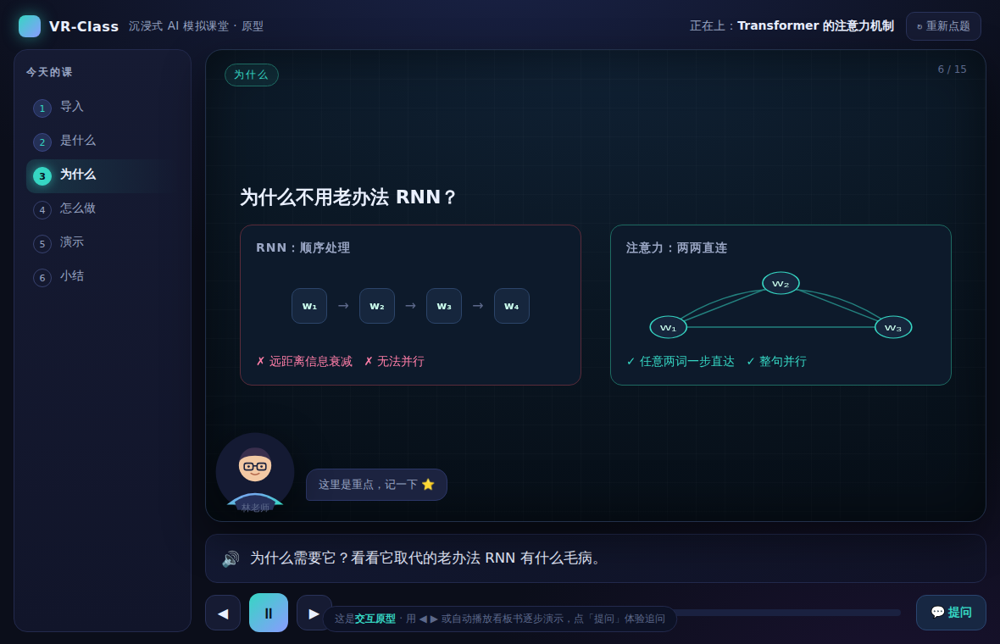
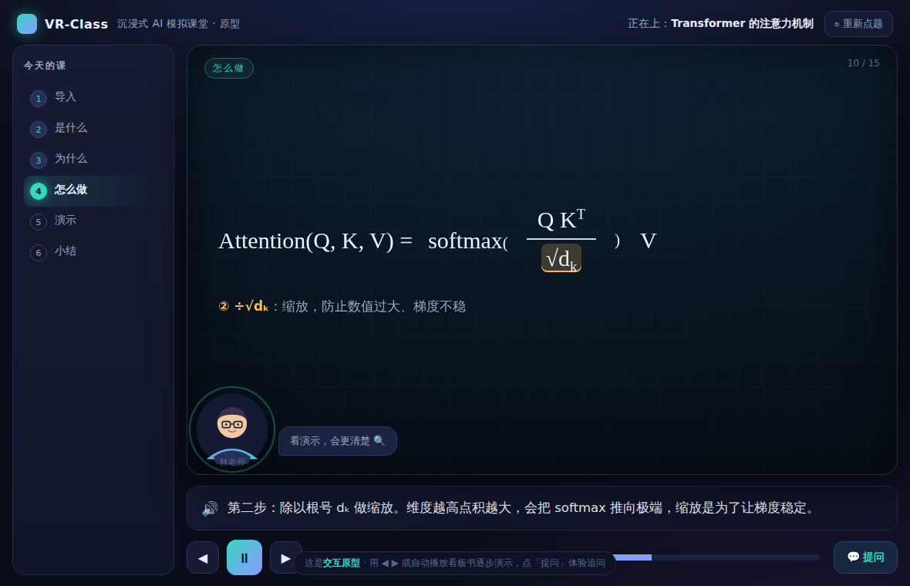
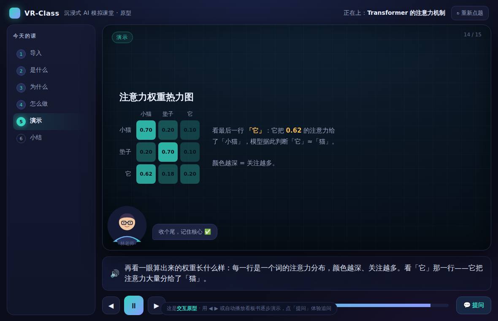

# 交互 / 视觉设计稿
# VR-Class · 虚拟教室

| 项目 | 内容 |
| --- | --- |
| 文档版本 | v0.1 |
| 状态 | 草稿，配可运行高保真原型 |
| 配套原型 | [`prototype/classroom.html`](../prototype/classroom.html)（**双击用浏览器打开即可，无需联网、无需安装**） |
| 关联文档 | [产品需求文档 PRD](PRD.md) · [样例课脚本](sample-lesson-attention.jsonc) |
| 最后更新 | 2026-06-25 |

> 本文是"虚拟教室长什么样、板书怎么逐步演示、老师立绘摆哪"的设计稿。所有截图来自配套的**可交互原型**——它真的能点、能播、能提问，演示的内容就是样例课《Transformer 的注意力机制》。
>
> **建议先打开 `prototype/classroom.html` 玩 1 分钟，再回来看本文。** 用 `◀ ▶` 或空格控制，点章节可跳转，点「提问」体验追问。

---

## 1. 设计目标与原则

延续 PRD 的三条灵魂，落到界面上就是三条设计准则：

| 原则 | 在界面上的含义 |
| --- | --- |
| **视觉优先** | 屏幕主体是**板书舞台**，不是文字流。讲解词只在字幕条里走一行，知识靠图/公式/动画/代码呈现。 |
| **老师在场** | 有一位**固定形象的老师**（林老师）在画面里，会"说话"（呼吸灯/口型）、会用气泡引导，让你感到"被教"。 |
| **低认知负荷** | 一屏只聚焦一件事：**当前这一个场景**。逐步呈现、一次一个要点，不堆砌。 |

**一句话设计目标**：让用户一进来就感到"我坐进了一间教室，有位老师正在给我一个人讲课"，而不是"我在用一个 App 读资料"。

---

## 2. 信息架构 / 页面地图

```
VR-Class
├── ① 入口 / 点题页        ……… 说出今天想学什么
│      │ （输入主题 / 点示例）
│      ▼
├── ②〔可选〕大纲确认       ……… 老师先列出今天要讲几点，可一句话调深浅（MVP 可内嵌进授课首屏）
│      ▼
├── ③ 授课页（核心）        ……… 章节导航 + 智能板书 + 老师立绘 + 字幕 + 控制条
│      ├── 提问浮层          ……… 随时举手，当前上下文作答，答完回到进度
│      └── 章节切换过渡
│      ▼
└── ④〔后续〕课程存档 / 回放
```

本设计稿 + 原型覆盖 **①、③、提问浮层**（MVP 核心闭环）。②④在 PRD 路线图中，本期从简。

---

## 3. 入口 / 点题页


**意图**：零学习成本地"开口点题"，并用示例降低冷启动门槛。

| 区域 | 说明 |
| --- | --- |
| 主标题 | "今天想学点 **什么**？"——渐变高亮"什么"，一句话点明产品就是"你来点、我来讲"。 |
| 输入框 | 大号、聚焦，placeholder 给出一个真实问句示例。回车或点「开始上课」进入。 |
| 示例 chips | 4 个**带学科标签**的示例（AI前沿 / 数理 / 概念 / 理科），对应 PRD 锁定的首发学科。点一下即填入。 |
| 副标题 | "说出一个主题，老师就在虚拟教室里，一笔一画讲给你看。"——传达视觉化授课的承诺。 |

> 交互细节：示例 chips 的学科标签用主题色区分，hover 上浮 + 边框点亮，暗示可点。

---

## 4. 授课页（核心）

这是产品 90% 时间停留的界面。整体采用"**舞台聚焦**"布局——四周压暗，中央板书最亮，模仿"在略暗的阶梯教室里看亮着的大屏"。


### 4.1 区域划分（线框）

```
┌─ 顶栏 ─────────────────────────────────────────────────────┐
│ LOGO  VR-Class           正在上：Transformer 的注意力机制  ↻重新点题 │
├──────────┬─────────────────────────────────────────────────┤
│          │  ┌─ 智能板书（舞台）────────────────────[ 6/15 ]┐ │
│ 章节导航  │  │ [导入]                                        │ │
│  ① 导入✓ │  │                                              │ │
│  ② 是什么 │  │        ← 知识内容逐步呈现 →                    │ │
│ ▶③ 为什么 │  │        文字/公式/图示/代码/动画/热力图           │ │
│  ④ 怎么做 │  │                                              │ │
│  ⑤ 演示   │  │  ┌──┐                                        │ │
│  ⑥ 小结   │  │  │👤│ 林老师 + 气泡（说话时呼吸灯）             │ │
│          │  │  └──┘                                        │ │
│          │  └──────────────────────────────────────────────┘ │
│          │  ┌─ 字幕条 ──────────────────────────────────────┐ │
│          │  │ 🔊 老师此刻正在讲的话……                        │ │
│          │  └──────────────────────────────────────────────┘ │
│          │  ◀  ⏸  ▶   [▓▓▓▓▓▓░░░░░░ 进度]        💬 提问      │
└──────────┴─────────────────────────────────────────────────┘
```

### 4.2 各区域职责

| # | 区域 | 职责与设计要点 |
| --- | --- | --- |
| 1 | **顶栏** | 左 LOGO，中显示当前课程标题，右"重新点题"。极简，不抢注意力。 |
| 2 | **章节导航（左栏）** | 显示本课章节（导入/是什么/…/小结）。当前章高亮，已学完打勾（teal）。**可点击跳转**，让学生掌控节奏。 |
| 3 | **智能板书（舞台中央）** | 知识呈现主体。左上角章节标签，右上角场景计数（如 6/15）。内容**逐步出现**（见第 5 章动效）。 |
| 4 | **老师立绘** | 固定在板书左下角，朝向板书。说话时**呼吸光环 + 引导气泡**。MVP 为静态立绘（PRD 决策 D4）。 |
| 5 | **字幕条** | 同步显示老师讲解词（= TTS 文本），一行精炼。可访问性与无声环境必备。 |
| 6 | **控制条** | 上一步 / 播放暂停 / 下一步 + 进度条 + 提问。播放即"自动开讲"，可随时暂停掌控。 |

> 键盘可达：`←` `→` 切换场景，`空格` 播放/暂停（已在原型实现）。

---

## 5. 智能板书：可视化类型 + 演示动效

板书是产品的命脉。每个**场景（Scene）**= 一段讲解 + 一块视觉。关键在于**逐步呈现**——模拟老师"边讲边写边画"，而非整屏闪现。这是沉浸感的来源。

### 5.1 已实现的板书类型（覆盖 PRD 首发学科）

| 类型 | 用于章节 | 截图 |
| --- | --- | --- |
| **钩子问题（hook）** | 导入 | [02](images/02-lesson-hook.png)：一句带高亮词的问题 + 引导 |
| **要点列表（points）** | 是什么 / 小结 | 标题 + 逐条浮现的要点，关键词 amber 高亮 |
| **对比图示（diagram）** | 为什么 | [03](images/03-compare.png)：RNN 顺序链 vs 注意力两两直连 |
| **公式（formula）** | 怎么做 | [04](images/04-formula.png)：分式渲染 + **分步高亮**当前讲的项 |
| **代码（code）** | 演示 | 语法高亮 + 行内注释，逐行出现 |
| **注意力热力图（heatmap）** | 演示 | [05](images/05-heatmap.png)：权重矩阵，颜色深浅=关注多少 |
| **随堂小测（quiz）** | 检验 | [07](images/07-quiz.png)：选项可点击，即时判分 + 错因解释 |

> 接入真 AI 后，这些视觉全部由后端生成的 Lesson Script 数据驱动渲染（公式走 KaTeX、图示走 Mermaid）。怎么跑见 [运行指南](RUNNING.md)。



### 5.2 板书演示动效规范（`board_action`）

演示脚本里每个场景带一个 `board_action`，前端据此播放动效：

| 动作 | 含义 | 动效规格（建议） |
| --- | --- | --- |
| `fade_in` | 整块淡入 | opacity 0→1 + 上移 14px，500ms，ease-out |
| `draw_step_by_step` | 图示分步绘制 | 节点/连线依次出现，每步 150–200ms 错峰 |
| `write_formula` | 公式逐项书写 | 各项依次淡入，模拟板书书写节奏 |
| `type_code` | 代码逐行打字 | 逐行出现，光标感 |
| `highlight` | 高亮/圈点当前讲到的部分 | 目标元素加 amber 底色 + 下划线，350ms 过渡 |
| `reveal_list` | 要点逐条出现 | 列表项 stagger，每条延迟 +180ms |
| `clear` | 翻页/擦除 | 旧内容淡出，新场景淡入 |



> 上图：讲到"÷√dₖ 缩放"时，公式里的 `√dₖ` 被 amber 高亮，其余变暗——这就是 `highlight` 动作。**老师讲到哪，板书就亮到哪**，这是"被教"感的关键。

### 5.3 注意力热力图（演示型视觉示例）



数据驱动的视觉同样由脚本生成：一个权重矩阵 → 渲染成颜色深浅不同的格子 + 文字解读。这类"把抽象算出来的东西画给你看"的视觉，是数理/AI 学科的杀手锏。

---

## 6. 老师立绘与"在场感"

| 状态 | 表现 |
| --- | --- |
| **讲解中（speaking）** | 立绘外圈**呼吸光环**（1.6s 循环）+ 引导气泡（"我们从一个直觉开始 👀"／"这里是重点，记一下 ⭐"），随章节切换。 |
| **等待提问** | 气泡："在听，随时可以打断我提问 🙋" |
| **回答中** | （提问浮层内）以"🎓 林老师"身份给出回答。 |

MVP 用**静态 SVG 立绘 + 呼吸灯 + 气泡**即可营造在场感（PRD 决策 D4），无需 3D/口型。后续可平滑升级为 2D 动态（Live2D/Rive）。

> 形象设定：戴眼镜、亲切，主题渐变配色。名字"林老师"为占位，可后续做人设体系。

---

## 7. 交互状态与流程

### 7.1 播放状态机

```
        点「开始上课」
            │
            ▼
   ┌──── 播放中(playing) ────┐
   │   每 ~4s 自动进入下一场景 │
   │   板书动效 + 字幕 + 立绘说话 │
   └───┬─────────┬───────────┘
       │暂停/手动  │点「提问」
       ▼          ▼
   暂停(paused)   提问浮层(asking) ── 答完「回到课堂」──► 恢复播放
       │
   ◀ ▶ / 点章节 → 跳转场景（保持暂停或续播）
            │
       最后一场景 → 自动暂停（课程结束）
```

### 7.2 提问浮层（追问）


**意图**：随时举手，但不丢失授课进度。

- 点「💬 提问」→ **自动暂停**当前讲解，弹出浮层。
- 老师在**当前进度的上下文**里作答（原型内置了 √dₖ、softmax 等示例问答）。
- 点「回到课堂 ▶」→ 关闭浮层、**从原处续播**。

> 产品化时：回答可不只是文字，而是**临时在板书上插入一两个演示场景**再讲，然后回到主线——这正是 PRD 6.2"互动分支"的体现。

---

## 8. 视觉风格

### 8.1 氛围与配色

"略暗的阶梯教室 + 发亮的智能屏"——压暗四周、突出板书，长时间看不累，且让内容有"舞台感"。

| 角色 | 色值 | 用途 |
| --- | --- | --- |
| 背景 | `#0b0e1a` / `#11152a` | 教室环境，深蓝紫，含微弱辉光 |
| 板书 | `#0a1622` + 细网格 | 中央舞台，深色"智能黑板" |
| 主题色 Teal | `#36d6c3` | 主操作、当前章、强调、老师配色 |
| 辅色 Indigo | `#8a9bff` | 渐变、次要强调 |
| 高亮 Amber | `#f7b955` | **板书重点高亮、关键词**（讲到哪亮到哪） |
| 文字 | `#eaf0ff` / `#9aa6c4` | 主文 / 弱化文字与字幕 |

> 选 Teal/Indigo + 深蓝紫底，是为契合 AI 前沿主题的"科技 + 专注"气质；Amber 专用于"老师正在强调"的瞬间，全局只此一个高亮色，避免视觉噪音。

### 8.2 字体

- 界面：系统无衬线（思源/PingFang/雅黑回退）。
- 公式：衬线数学字体（Cambria Math / Times）以贴近教科书观感。
- 代码：等宽（JetBrains Mono / Consolas）。

### 8.3 排版节奏

- 板书一屏**只讲一件事**，标题 28–30px，要点 19px，留白充足。
- 逐步呈现：每条要点/每个图元错峰出现，给眼睛"跟得上"的节奏。

---

## 9. 响应式与可访问性

| 维度 | 方案 |
| --- | --- |
| 桌面（≥1024px） | 左章节栏 + 中舞台 三段式（如截图）。 |
| 平板/窄屏（<780px） | 章节栏收起为顶部下拉/进度点，板书与字幕占满宽度（原型已含断点）。 |
| 字幕 | 全程显示讲解词，支持无声环境与听障。 |
| 语速/字号 | 规划中：可调 TTS 语速、板书字号。 |
| 对比度 | 深底亮字，正文对比度达 WCAG AA。 |
| 键盘 | `← →` 切场景、`空格` 播放暂停；操作均可键盘到达。 |
| 减少动画 | 规划：尊重 `prefers-reduced-motion`，关掉非必要动效。 |

---

## 10. 设计稿 ↔ 原型 ↔ 数据 的对应关系

本设计稿不是静态图，而是**可运行原型**，且与数据契约一一对应：

```
docs/UX-Design.md（本文，设计规格）
        │ 描述
        ▼
prototype/classroom.html（可交互高保真原型）
        │ 播放
        ▼
LESSON.scenes[]（脚本：narration + render + board_action）
        │ 即 PRD §5.3 的 Lesson Script 子集
        ▼
docs/sample-lesson-attention.jsonc（完整样例课脚本）
```

> 也就是说：**改一条脚本数据，原型里这一课就变了**——这正是 PRD 主张的"课 = 可播放的结构化脚本"。前端是通用播放器，内容全由脚本驱动。

---

## 11. 本稿范围与下一步

**已交付（本稿 + 原型）**：入口点题、授课页全区域、6 类板书视觉、逐步呈现 + 高亮动效、老师在场、提问浮层、播放状态机、配色与字体规范、响应式与可访问性骨架。

**建议下一步细化**：

1. **大纲确认页（②）** 的视觉与"一句话调深浅"交互。
2. **更多板书类型**：图表、生成插图、数学过程动画（Manim 类）的呈现规范（PRD v0.2）。
3. **章节切换过渡** 与 TTS·板书的**精确时序对齐**规格。
4. **老师人设体系**（多形象/音色）与 2D 动态升级路径。
5. **设计 token 与组件库**：把本稿的颜色/间距/动效沉淀为可复用规范，供 MVP 开发直接落地。

---

*本设计稿为 v0.1，配套可运行原型。欢迎直接在原型上感受、在本文上批注。*
